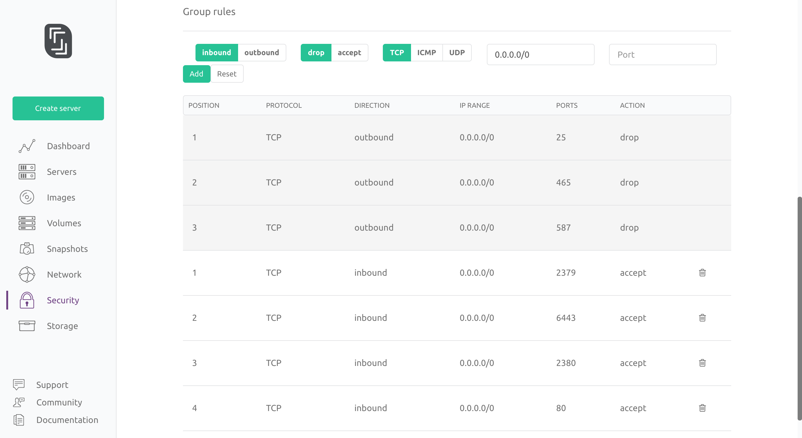
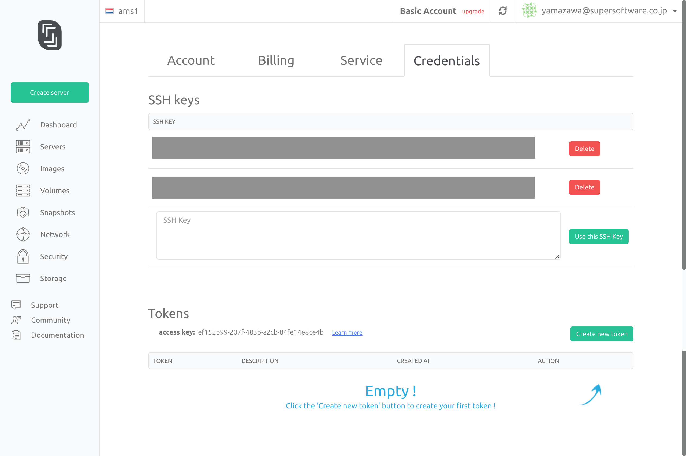
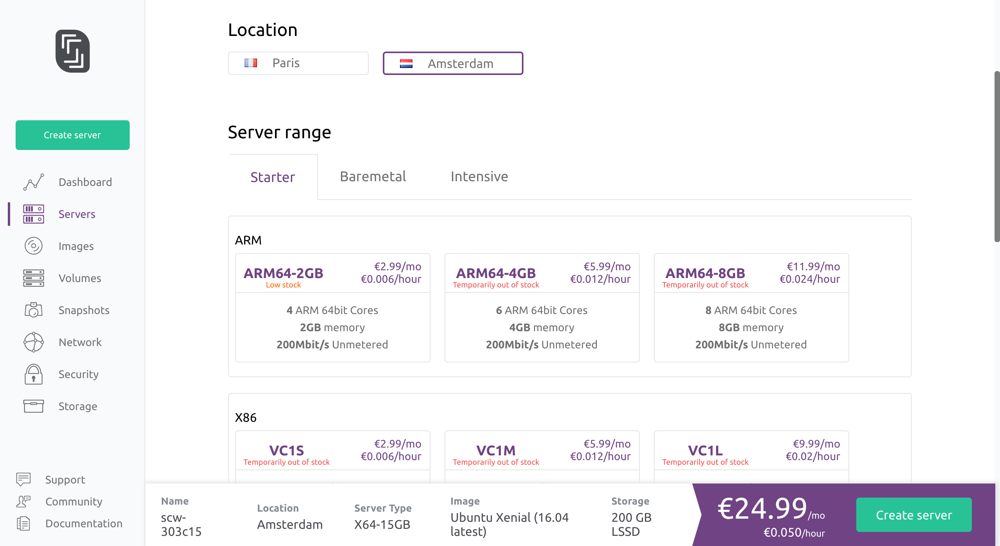
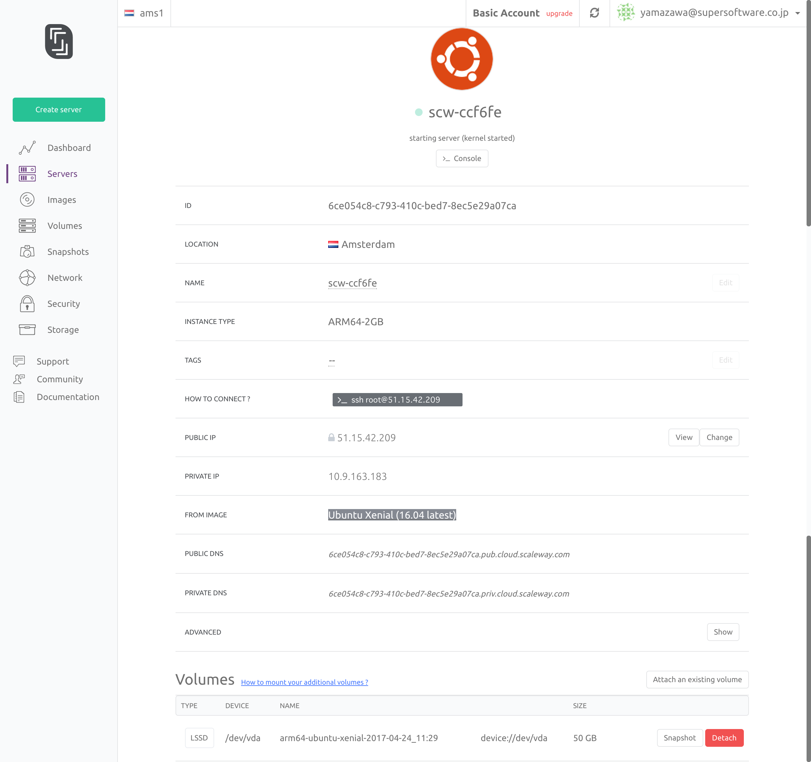
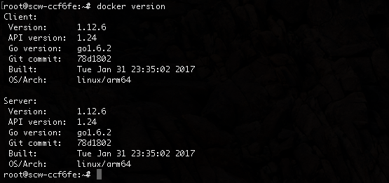
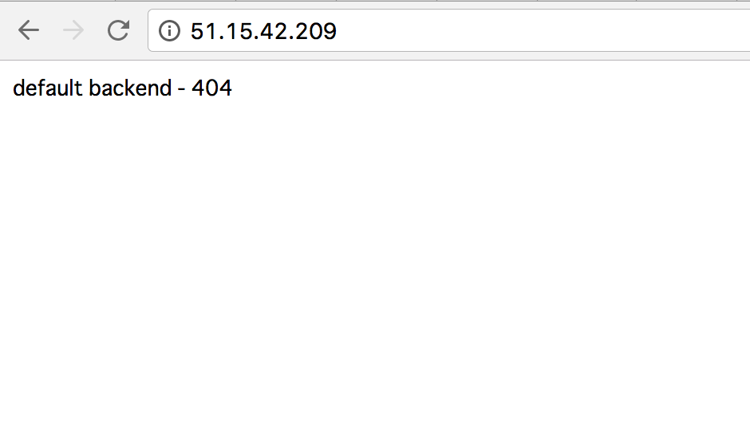

# Deploy Kubernetes ARM64 on Scaleway

PoC by [kyamazawa](https://twitter.com/kyamazawa_ssl)

## Prerequisites


* A [Scaleway](https://www.scaleway.com) account
* [rke](https://github.com/rancher/rke/releases) (Rancher Kubernetes Engine) to deploy Kubernetes
  * Download your architecture's binary and put it somewhere in your `PATH`
  * Also, rename it to `rke` if necessary
* An ARM64 Machine (we're going to use ARM64-2GB in Scaleway)
  * 4 ARM 64bit Cores
  * 2GB Memory
  * 50GB SSD Disk
  * 1 Flexible public IPv4
  * 200Mbit/s Unmetered bandwidth


## Deploying

### Setting the Security Group

As mentioned in the rke [README.md](https://github.com/rancher/rke) , open ports 6443, 2379, 2380, and 80.




### Register SSH Key

Register your SSH Keys in order to ssh in to your machines




### Spin up the Server

Spin up a ARM64-2GB machine with `Ubuntu Xenial (16.04 latest)`




Press `Create server` and you should see some thing like the following:




### Install Docker

After the server spins up, let's install `Docker 1.12.6`. There aren't repositories including this version so we're going to use [docker.io_1.12.6-0ubuntu1-16.04.1_arm64.deb](https://launchpad.net/ubuntu/+source/docker.io/1.12.6-0ubuntu1~16.04.1/+build/11948861) .

In addition, we're going to use `gdebi` for dependencies.


```bash
# wget https://launchpad.net/ubuntu/+source/docker.io/1.12.6-0ubuntu1~16.04.1/+build/11948861/+files/docker.io_1.12.6-0ubuntu1~16.04.1_arm64.deb
# apt-get update && apt-get install -y gdebi
# gdebi ./docker.io_1.12.6-0ubuntu1~16.04.1_arm64.deb
```


If installation succeeds, hit `docker version` and you should see something similar to this:




### Get Ready to Deploy Kubernetes

By default at the current time, there aren't any ARM64 images for the kubernetes provided from Rancher so here are some custom builds you can use.

> Note that these images are for PoC only. Don't use them in Production!


- infra_container_image: **supersoftware/pause-arm64:3.0**
- etcd: **mirrorgooglecontainers/etcd-arm64:3.2.14**
- alpine: **arm64v8/alpine**
- nginx_proxy: **supersoftware/rke-nginx-proxy-arm64:v0.1.1**
- cert_downloader: **supersoftware/rke-cert-deployer-arm64:0.1.1**
- kubernetes_services_sidecar: **supersoftware/rke-service-sidekick:v0.1.0**
- kubedns: **supersoftware/k8s-dns-kube-dns-arm64:1.14.5**
- dnsmasq: **supersoftware/k8s-dns-dnsmasq-nanny-arm64:1.14.5**
- kubedns_sidecar: **supersoftware/k8s-dns-sidecar-arm64:1.14.5**
- kubedns_autoscaler: **supersoftware/cluster-proportional-autoscaler-arm64:1.0.0**
- kubernetes: **supersoftware/k8s-arm64:v1.8.7-rancher1-1**
- flannel: **supersoftware/flannel-arm64:v0.9.1**
- flannel_cni: **supersoftware/flannel-cni-arm64:v0.2.0**


Create a `cluster.yaml` that uses the images above (remember to change `<PUT_YOUR_NODES_IP_ADDRESS_HERE>` !!):

> Note that we're setting ingress.provider to `none`. It's because there isn't an ARM64 version of the ingress controller. We'll add a custom version later.


```
nodes:
- address: <PUT_YOUR_NODES_IP_ADDRESS_HERE>
  internal_address: ""
  role:
  - controlplane
  - worker
  - etcd
  hostname_override: ""
  user: root
  docker_socket: /var/run/docker.sock
  ssh_key: ""
  ssh_key_path: ~/.ssh/id_rsa
  labels: {}
services:
  etcd:
    image: mirrorgooglecontainers/etcd-arm64:3.2.14
    extra_args: {}
  kube-api:
    image: supersoftware/k8s-arm64:v1.8.7-rancher1-1
    extra_args: {}
    service_cluster_ip_range: 10.233.0.0/18
    pod_security_policy: false
  kube-controller:
    image: supersoftware/k8s-arm64:v1.8.7-rancher1-1
    extra_args: {}
    cluster_cidr: 10.233.64.0/18
    service_cluster_ip_range: 10.233.0.0/18
  scheduler:
    image: supersoftware/k8s-arm64:v1.8.7-rancher1-1
    extra_args: {}
  kubelet:
    image: supersoftware/k8s-arm64:v1.8.7-rancher1-1
    extra_args: {}
    cluster_domain: cluster.local
    infra_container_image: supersoftware/pause-arm64:3.0
    cluster_dns_server: 10.233.0.3
    fail_swap_on: false
  kubeproxy:
    image: supersoftware/k8s-arm64:v1.8.7-rancher1-1
    extra_args: {}
network:
  plugin: flannel
  options: {}
authentication:
  strategy: x509
  options: {}
addons: ""
system_images:
  etcd: mirrorgooglecontainers/etcd-arm64:3.2.14
  alpine: arm64v8/alpine
  nginx_proxy: supersoftware/rke-nginx-proxy-arm64:v0.1.1
  cert_downloader: supersoftware/rke-cert-deployer-arm64:0.1.1
  kubernetes_services_sidecar: supersoftware/rke-service-sidekick:v0.1.0
  kubedns: supersoftware/k8s-dns-kube-dns-arm64:1.14.5
  dnsmasq: supersoftware/k8s-dns-dnsmasq-nanny-arm64:1.14.5
  kubedns_sidecar: supersoftware/k8s-dns-sidecar-arm64:1.14.5
  kubedns_autoscaler: supersoftware/cluster-proportional-autoscaler-arm64:1.0.0
  kubernetes: supersoftware/k8s-arm64:v1.8.7-rancher1-1
  flannel: supersoftware/flannel-arm64:v0.9.1
  flannel_cni: supersoftware/flannel-cni-arm64:v0.2.0
  calico_node: ""
  calico_cni: ""
  calico_controllers: ""
  calico_ctl: ""
  canal_node: ""
  canal_cni: ""
  canal_flannel: ""
  wave_node: ""
  weave_cni: ""
  pod_infra_container: ""
ssh_key_path: ~/.ssh/id_rsa
authorization:
  mode: rbac
  options: {}
ignore_docker_version: false
kubernetes_version: ""
private_registries: []
ingress:
  provider: none
  options: {}
  node_selector: {}
```


### Deploy Kubernetes!

Hit

```bash
rke up
```


and the deploy will begin. It will take about 5 to 10 minutes to complete.

The logs would look something like this.


```bash
bash-4.4# rke up
INFO[0000] Building Kubernetes cluster                  
INFO[0000] [dialer] Setup tunnel for host [51.15.42.209] 
INFO[0003] [network] Deploying port listener containers 
INFO[0005] [network] Successfully started [rke-etcd-port-listener] container on host [51.15.42.209] 
INFO[0007] [network] Successfully started [rke-cp-port-listener] container on host [51.15.42.209] 
INFO[0009] [network] Successfully started [rke-worker-port-listener] container on host [51.15.42.209] 
INFO[0009] [network] Port listener containers deployed successfully 
INFO[0009] [network] Running all -> etcd port checks    
INFO[0011] [network] Successfully started [rke-port-checker] container on host [51.15.42.209] 
INFO[0018] [network] Successfully started [rke-port-checker] container on host [51.15.42.209] 
INFO[0019] [network] Running control plane -> etcd port checks 
INFO[0021] [network] Successfully started [rke-port-checker] container on host [51.15.42.209] 
INFO[0022] [network] Running workers -> control plane port checks 
INFO[0024] [network] Successfully started [rke-port-checker] container on host [51.15.42.209] 
INFO[0026] [network] Checking KubeAPI port Control Plane hosts 
INFO[0026] [network] Removing port listener containers  
INFO[0028] [remove/rke-etcd-port-listener] Successfully removed container on host [51.15.42.209] 
INFO[0029] [remove/rke-cp-port-listener] Successfully removed container on host [51.15.42.209] 
INFO[0030] [remove/rke-worker-port-listener] Successfully removed container on host [51.15.42.209] 
INFO[0030] [network] Port listener containers removed successfully 
INFO[0030] [certificates] Attempting to recover certificates from backup on host [51.15.42.209] 
INFO[0032] [certificates] Successfully started [cert-fetcher] container on host [51.15.42.209] 
INFO[0033] [certificates] No Certificate backup found on host [51.15.42.209] 
INFO[0033] [certificates] Generating kubernetes certificates 
INFO[0033] [certificates] Generating CA kubernetes certificates 
INFO[0033] [certificates] Generating Kubernetes API server certificates 
INFO[0033] [certificates] Generating Kube Controller certificates 
INFO[0034] [certificates] Generating Kube Scheduler certificates 
INFO[0034] [certificates] Generating Kube Proxy certificates 
INFO[0034] [certificates] Generating Node certificate   
INFO[0035] [certificates] Generating admin certificates and kubeconfig 
INFO[0035] [certificates] Generating etcd-51.15.42.209 certificate and key 
INFO[0035] [certificates] Temporarily saving certs to etcd host [51.15.42.209] 
INFO[0044] [certificates] Saved certs to etcd host [51.15.42.209] 
INFO[0044] [reconcile] Reconciling cluster state        
INFO[0044] [reconcile] This is newly generated cluster  
INFO[0044] [certificates] Deploying kubernetes certificates to Cluster nodes 
INFO[0053] Successfully Deployed local admin kubeconfig at [./kube_config_cluster.yml] 
INFO[0053] [certificates] Successfully deployed kubernetes certificates to Cluster nodes 
INFO[0053] Pre-pulling kubernetes images                
INFO[0054] Kubernetes images pulled successfully        
INFO[0054] [etcd] Building up Etcd Plane..              
INFO[0055] [etcd] Successfully started [etcd] container on host [51.15.42.209] 
INFO[0055] [etcd] Successfully started Etcd Plane..     
INFO[0055] [controlplane] Building up Controller Plane.. 
INFO[0059] [controlplane] Successfully started [kube-api] container on host [51.15.42.209] 
INFO[0059] [healthcheck] Start Healthcheck on service [kube-api] on host [51.15.42.209] 
INFO[0094] [healthcheck] service [kube-api] on host [51.15.42.209] is healthy 
INFO[0096] [controlplane] Successfully started [kube-controller] container on host [51.15.42.209] 
INFO[0096] [healthcheck] Start Healthcheck on service [kube-controller] on host [51.15.42.209] 
INFO[0099] [healthcheck] service [kube-controller] on host [51.15.42.209] is healthy 
INFO[0101] [controlplane] Successfully started [scheduler] container on host [51.15.42.209] 
INFO[0101] [healthcheck] Start Healthcheck on service [scheduler] on host [51.15.42.209] 
INFO[0104] [healthcheck] service [scheduler] on host [51.15.42.209] is healthy 
INFO[0104] [controlplane] Successfully started Controller Plane.. 
INFO[0104] [authz] Creating rke-job-deployer ServiceAccount 
INFO[0107] [authz] rke-job-deployer ServiceAccount created successfully 
INFO[0107] [authz] Creating system:node ClusterRoleBinding 
INFO[0108] [authz] system:node ClusterRoleBinding created successfully 
INFO[0108] [certificates] Save kubernetes certificates as secrets 
INFO[0110] [certificates] Successfully saved certificates as kubernetes secret [k8s-certs] 
INFO[0110] [state] Saving cluster state to Kubernetes   
INFO[0111] [state] Successfully Saved cluster state to Kubernetes ConfigMap: cluster-state 
INFO[0111] [worker] Building up Worker Plane..          
INFO[0111] [sidekick] Sidekick container already created on host [51.15.42.209] 
INFO[0114] [worker] Successfully started [kubelet] container on host [51.15.42.209] 
INFO[0114] [healthcheck] Start Healthcheck on service [kubelet] on host [51.15.42.209] 
INFO[0126] [healthcheck] service [kubelet] on host [51.15.42.209] is healthy 
INFO[0128] [worker] Successfully started [kube-proxy] container on host [51.15.42.209] 
INFO[0128] [healthcheck] Start Healthcheck on service [kube-proxy] on host [51.15.42.209] 
INFO[0131] [healthcheck] service [kube-proxy] on host [51.15.42.209] is healthy 
INFO[0132] [sidekick] Sidekick container already created on host [51.15.42.209] 
INFO[0132] [healthcheck] Start Healthcheck on service [kubelet] on host [51.15.42.209] 
INFO[0136] [healthcheck] service [kubelet] on host [51.15.42.209] is healthy 
INFO[0137] [healthcheck] Start Healthcheck on service [kube-proxy] on host [51.15.42.209] 
INFO[0141] [healthcheck] service [kube-proxy] on host [51.15.42.209] is healthy 
INFO[0142] [sidekick] Sidekick container already created on host [51.15.42.209] 
INFO[0143] [healthcheck] Start Healthcheck on service [kubelet] on host [51.15.42.209] 
INFO[0147] [healthcheck] service [kubelet] on host [51.15.42.209] is healthy 
INFO[0148] [healthcheck] Start Healthcheck on service [kube-proxy] on host [51.15.42.209] 
INFO[0151] [healthcheck] service [kube-proxy] on host [51.15.42.209] is healthy 
INFO[0151] [worker] Successfully started Worker Plane.. 
INFO[0151] [network] Setting up network plugin: flannel 
INFO[0151] [addons] Saving addon ConfigMap to Kubernetes 
INFO[0152] [addons] Successfully Saved addon to Kubernetes ConfigMap: rke-network-plugin 
INFO[0152] [addons] Executing deploy job..              
INFO[0158] [sync] Syncing nodes Labels and Taints       
INFO[0160] [sync] Successfully synced nodes Labels and Taints 
INFO[0160] [addons] Setting up KubeDNS                  
INFO[0160] [addons] Saving addon ConfigMap to Kubernetes 
INFO[0160] [addons] Successfully Saved addon to Kubernetes ConfigMap: rke-kubedns-addon 
INFO[0160] [addons] Executing deploy job..              
INFO[0166] [addons] KubeDNS deployed successfully..     
INFO[0166] [ingress] Setting up none ingress controller 
INFO[0166] [ingress] ingress controller is not defined  
INFO[0166] [addons] Setting up user addons..            
INFO[0166] [addons] No user addons configured..         
INFO[0166] Finished building Kubernetes cluster successfully 
```


After the deploy is successfull, there will be a `kube_config_cluster.yml` file in the current directory. Use this as your `kubeconfig` and you can hit the cluster!

Let's export it for use.

```bash
export KUBECONFIG=/work/kube_config_cluster.yml
```


Let's fetch some info from the cluster:

```
bash-4.4# kubectl get node,all --all-namespaces
NAME              STATUS    ROLES                AGE       VERSION
no/51.15.42.209   Ready     etcd,master,worker   7m        v1.8.7-rancher1-dirty

NAMESPACE     NAME              DESIRED   CURRENT   READY     UP-TO-DATE   AVAILABLE   NODE SELECTOR   AGE
kube-system   ds/kube-flannel   1         1         1         1            1           <none>          6m

NAMESPACE     NAME                         DESIRED   CURRENT   UP-TO-DATE   AVAILABLE   AGE
kube-system   deploy/kube-dns              1         1         1            1           6m
kube-system   deploy/kube-dns-autoscaler   1         1         1            1           6m

NAMESPACE     NAME                                DESIRED   CURRENT   READY     AGE
kube-system   rs/kube-dns-6ffd65c86b              1         1         1         6m
kube-system   rs/kube-dns-autoscaler-65bbcbdc69   1         1         1         6m

NAMESPACE     NAME                         DESIRED   CURRENT   UP-TO-DATE   AVAILABLE   AGE
kube-system   deploy/kube-dns              1         1         1            1           6m
kube-system   deploy/kube-dns-autoscaler   1         1         1            1           6m

NAMESPACE     NAME              DESIRED   CURRENT   READY     UP-TO-DATE   AVAILABLE   NODE SELECTOR   AGE
kube-system   ds/kube-flannel   1         1         1         1            1           <none>          6m

NAMESPACE     NAME                                DESIRED   CURRENT   READY     AGE
kube-system   rs/kube-dns-6ffd65c86b              1         1         1         6m
kube-system   rs/kube-dns-autoscaler-65bbcbdc69   1         1         1         6m

NAMESPACE     NAME                                 DESIRED   SUCCESSFUL   AGE
kube-system   jobs/rke-kubedns-addon-deploy-job    1         1            6m
kube-system   jobs/rke-network-plugin-deploy-job   1         1            6m

NAMESPACE     NAME                                      READY     STATUS    RESTARTS   AGE
kube-system   po/kube-dns-6ffd65c86b-pnhrx              3/3       Running   0          6m
kube-system   po/kube-dns-autoscaler-65bbcbdc69-57mp7   1/1       Running   0          6m
kube-system   po/kube-flannel-rqt2j                     2/2       Running   0          6m

NAMESPACE     NAME             TYPE        CLUSTER-IP   EXTERNAL-IP   PORT(S)         AGE
default       svc/kubernetes   ClusterIP   10.233.0.1   <none>        443/TCP         7m
kube-system   svc/kube-dns     ClusterIP   10.233.0.3   <none>        53/UDP,53/TCP   6m
```


Now you have a working Kubernetes cluster on ARM64!


### Deploying an Ingress Controller

We've built an ARM64 version of the Ingress Controller. You can deploy it with the following command:

```bash
bash-4.4# kubectl apply -f https://github.com/kyamazawa/kubernetes/releases/download/v1.8.7-rancher1/ingress-nginx-arm64.yaml

namespace "ingress-nginx" created
deployment "default-http-backend" created
service "default-http-backend" created
configmap "nginx-configuration" created
configmap "tcp-services" created
configmap "udp-services" created
deployment "nginx-ingress-controller" created
serviceaccount "nginx-ingress-serviceaccount" created
clusterrole "nginx-ingress-clusterrole" created
role "nginx-ingress-role" created
rolebinding "nginx-ingress-role-nisa-binding" created
clusterrolebinding "nginx-ingress-clusterrole-nisa-binding" created
```


After a while you can check it out:

```bash
bash-4.4# kubectl -n ingress-nginx get all
NAME                              DESIRED   CURRENT   UP-TO-DATE   AVAILABLE   AGE
deploy/default-http-backend       1         1         1            1           1m
deploy/nginx-ingress-controller   1         1         1            1           1m

NAME                                     DESIRED   CURRENT   READY     AGE
rs/default-http-backend-659bdd9f56       1         1         1         1m
rs/nginx-ingress-controller-7f7d4d7775   1         1         1         1m

NAME                              DESIRED   CURRENT   UP-TO-DATE   AVAILABLE   AGE
deploy/default-http-backend       1         1         1            1           1m
deploy/nginx-ingress-controller   1         1         1            1           1m

NAME                                     DESIRED   CURRENT   READY     AGE
rs/default-http-backend-659bdd9f56       1         1         1         1m
rs/nginx-ingress-controller-7f7d4d7775   1         1         1         1m

NAME                                           READY     STATUS    RESTARTS   AGE
po/default-http-backend-659bdd9f56-8g4z8       1/1       Running   0          1m
po/nginx-ingress-controller-7f7d4d7775-95vdj   1/1       Running   1          1m

NAME                       TYPE        CLUSTER-IP    EXTERNAL-IP   PORT(S)   AGE
svc/default-http-backend   ClusterIP   10.233.1.29   <none>        80/TCP    1m
```


We can check it by accessing the IP:




You now have a working ingress controller. Enjoy your ARM64 Kubernetes cluster built with rke!
